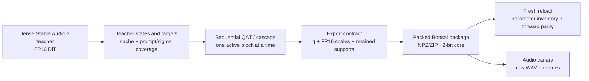

---
language:
- en
- fr
tags:
- stable-audio
- stable-audio-3
- audio-generation
- ternary-quantization
- bonsai
- mlx
- apple-silicon
pipeline_tag: text-to-audio
license: other
library_name: mlx
---

<div align="center">

# Stable Audio 3 · Bonsai Ternary

### A reproducible personal-study package for a strict ternary DiT core

`{-1, 0, +1}` · G32 · 2-bit packing · 24 blocks · 168 ternary matrices

[](model/manifest.json)
[](model/payload.npz)
[](model/reload_report.json)
[](model/acceptance.json)

</div>

This repository is the clean, extracted record of the Stable Audio 3 Medium
DiT ternarisation work carried out in the `abelton` project. It preserves the
implementation, the experiment history, the compact model package and the
fresh verification evidence without copying the unrelated application code.

The method follows the Bonsai-style compromise requested for this study:
strict ternary codes for the attention and FFN core, native-precision support
tensors for the rest of the DiT, and an explicit runtime contract for direct
and block-input Hadamard members. It is not advertised as a claim that every
scalar in Stable Audio 3 is ternary.

## Result at a glance

| Item | Recorded result |
|---|---:|
| Stable Audio 3 DiT | Medium, latent crop 128 |
| Core scope | 24 blocks × 7 projections = **168** matrices |
| Ternary alphabet | `q ∈ {-1, 0, +1}` |
| Quantisation | symmetric `W = scale × q`, one FP16 scale per G32 group |
| Runtime modes | 42 direct symmetric + 126 symmetric-Hadamard matrices |
| Native support tensors | **357**, including retained biases |
| Packed ternary codes | **1,358,954,496** |
| Logical payload | 613,897,248 bytes |
| Compressed payload | **513,342,833 bytes**, below the 650 MB envelope |
| Reload inventory | 732 parameters, exact |
| Fresh package forward check | relative L2 `0.0`, cosine `1.0` |
| Audio canary | finite, 44.1 kHz, technical check passed |

The package was accepted by Guillaume for personal study after an A/B listen.
The stricter automatic release gates were deliberately not hidden: the final
velocity mean cosine is `0.876934`, the minimum is `0.646171`, and the audio
canary cosine is `0.852056`. Therefore this repository distinguishes **format
success and local listening acceptance** from a blind, general release-quality
claim.

## How the pieces fit



## Start here

- [Exact method and data contract](docs/METHOD.md)
- [Reproduction and verification](docs/REPRODUCTION.md)
- [Measured results and honest limitations](docs/RESULTS.md)
- [Research notes and lessons from failed runs](docs/RESEARCH.md)
- [Extraction map from the original repository](docs/SOURCE_MAP.md)
- [Historical plans and reports](docs/history/)
- [Compact model package](model/)
- [Notices and redistribution boundaries](NOTICE.md)

## Verify the published artifact

The verification script needs the original Stable Audio 3 MLX runtime and the
teacher weights. The teacher is intentionally **not** redistributed here.

```bash
python3 services/musicgen/verify_ternary_bonsai_package.py \
  --package-dir model \
  --teacher-weights /path/to/dit_medium_f16.npz \
  --dataset-dir /path/to/ternary-quality-v3/g2-authorized-independent/train \
  --sample-index 0 \
  --sigma 0.5 \
  --seed 20260925
```

On the original Apple-Silicon environment, the command passed the structural
checks recorded in [`model/reload_report.json`](model/reload_report.json).
`rtk proxy` may be used locally when that command wrapper is installed.

## Repository and model card

The canonical Git repository and the corresponding Hugging Face model page
are kept as paired publication targets. Their links are recorded here and in
[`model/README.md`](model/README.md). The Hugging Face repository contains
this documentation, the extracted implementation, the evidence and the
compact package; it does not contain the 2.9 GB dense teacher.

## Scope boundary

The artifact covers the DiT Bonsai core. The text encoder, codec, external
Stable Audio runtime, original teacher weights, generated training caches and
unrelated music-generation application code remain outside this repository.
This boundary is intentional: it makes the experiment auditable and keeps the
published package small enough to inspect and download.

## Citation

If this package is useful in a personal experiment, cite the repository and
the exact package manifest. The artifact is an engineering study, not an
official Stability AI release and not a benchmark leaderboard submission.

